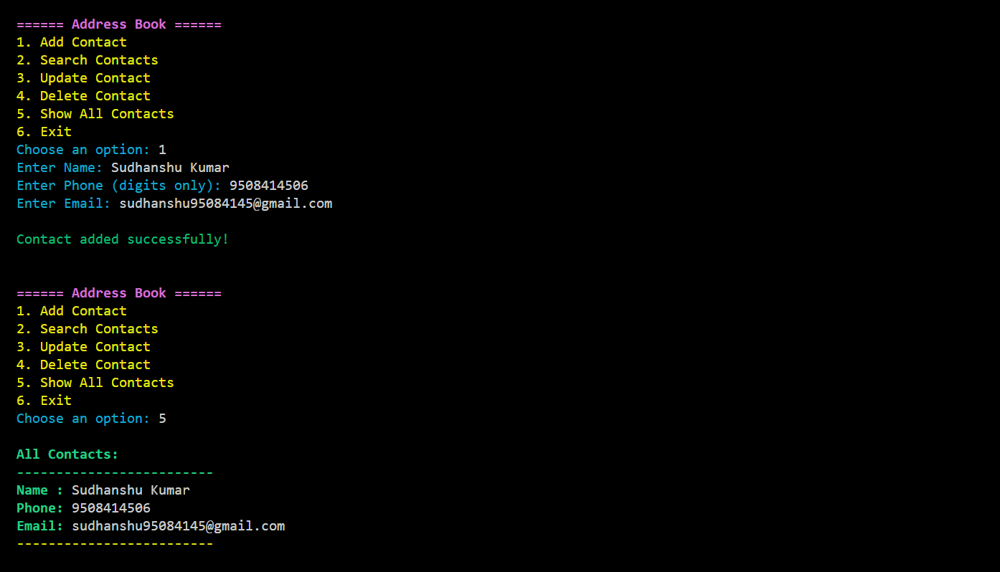

# 📒 Address Book

A simple console-based C++ Address Book application that allows you to manage your contacts efficiently.  
It supports adding, searching, updating, deleting, and viewing contacts, with all data saved persistently in a binary file.

---

## 🚀 Demo

#### 📸 Screenshots

  
*(Replace with your actual screenshot)*

---

## ✨ Features

- 📋 Add Contact – Store name, phone number, and email with validation.
- 🔍 Search Contact – Search by name or phone number.
- ✏️ Update Contact – Modify contact details.
- 🗑️ Delete Contact – Remove contacts by name.
- 👁️ View All Contacts – Display all saved contacts.
- 💾 Persistent Storage – Saves all contacts to a binary file (`contacts.dat`).
- 🎨 Colorful Terminal UI – Uses ANSI colors for better UX.
- 🛡️ Input Validation – Ensures proper data entry.

---

## 🛠️ Technologies Used

| Technology  | Purpose                        |
|-------------|--------------------------------|
| C++         | Core application logic         |
| STL Vector  | In-memory data structure       |
| File I/O    | Save and load contacts         |
| ANSI Colors | Colorful terminal output       |

---

# 📜 Application Rules

- Contact names must only contain alphabets and spaces.

- Phone numbers should be numeric only.

- Email validation is basic (must contain '@' and '.').

- All data is saved to `contacts.dat` file automatically on exit.

- When program starts, previously saved contacts are loaded automatically.

---

# 📫 Feedback

If you have any suggestions, feedback, or improvements:

**📬 Email:** sudhanshu95084145@gmail.com  

