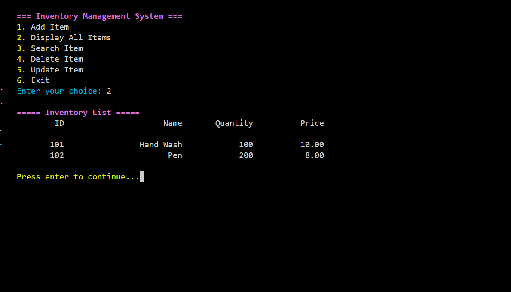

# 🧮 Inventory Management System

A modern and colorful **C++ Console Application** for managing inventory items like products in a store. This project allows adding, viewing, updating, and deleting inventory items with proper validations and clean terminal UI using ANSI color codes.

It is designed for students, beginners, and learning-focused C++ developers.

---

## 🚀 Demo

#### 📸 Screenshots

  

---

## ✨ Features

- 📥 **Add Item** – Enter item ID, name, quantity, and price with full validation.

- 📃 **Display All Items** – View all inventory items with aligned formatting.

- 🔍 **Search Item by ID** – Quickly find any item using its ID.

- 🗑️ **Delete Item** – Remove an item permanently by its ID.

- ✏️ **Update Item** – Change the details of an existing item.

- 🔐 **Input Validation** – Accepts only valid inputs (e.g., no alphabets in ID/quantity/price).

- 🌈 **Colorful Terminal Interface** – ANSI escape sequences add modern styling to output.

---

## 🕹️ How to Use

- **Run the program** – Compile the code and launch the app in terminal/console.
- **Choose from the menu:**
  1. Add a new item
  2. Display all items
  3. Search item by ID
  4. Delete item by ID
  5. Update item
  6. Exit the application
- Input fields:
  - 📦 Item ID → Numeric only
  - 📝 Name → Alphabetic characters (A-Z, a-z, space)
  - 🔢 Quantity → Positive integers
  - 💲 Price → Floating-point numbers (e.g., 49.99)

---

## 📜 Application Rules

- Only valid input is accepted (no strings for numbers).
- Every item must have a **unique ID**.
- File `inventory.dat` stores data persistently in binary format.
- Attempts to update/delete/search an invalid ID will prompt an error message.
- The application handles file I/O and re-validates user input until it's correct.

---

## 🛠️ Tech Stack

| Technology   | Purpose                                      |
|--------------|----------------------------------------------|
| C++          | Core programming logic                       |
| STL          | File handling using `<fstream>`              |
| Structs      | Representing item data                       |
| ANSI Colors  | Visual terminal output enhancement           |
| Input Loops  | Data entry validation (using `cin.fail()`)   |

---

## 💻 Compile & Run

### ✅ Requirements

- C++ compiler (g++, MinGW, etc.)

### 🧾 Commands

For Linux/macOS:

g++ InventoryManagement.cpp -o InventoryManagement
./InventoryManagement

## 📫 Feedback
If you have any suggestions, questions, or found a bug, feel free to connect:

📬 Email: sudhanshu95084145@gmail.com
