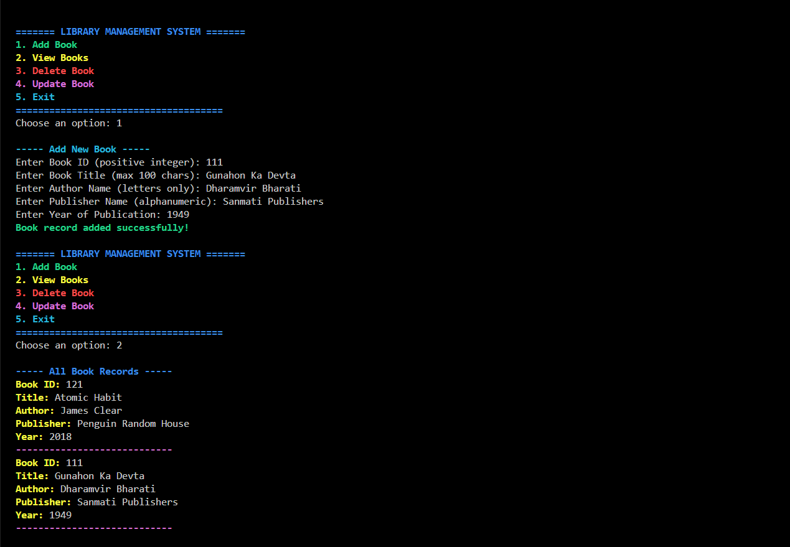

# 📚 Library Management System

- The Library Management System is a console-based C++ application to manage a collection of books in a library using a binary file.

- It allows users to add, view, update, and delete book details like ID, title, author, and publication year.

- Designed with color-coded outputs and robust input validation for an enhanced terminal experience.

## 🚀 Demo

#### 📸 Screenshots

  

## ✨ Features

- 📋 Add New Book – Enter book ID, title, author, and year with validation.

- 🗑️ Delete Book – Remove a book using its unique ID.

- ✏️ Update Record – Modify existing book details.

- 👁️ View All Books – Display all books with formatted output.

- 🔒 Input Validation – Ensures data integrity (e.g., numeric IDs, valid year, letters in title/author).

- 🎨 Colored Terminal Interface – Visually enhanced console using ANSI escape codes.

## 🕹️ How to Use

- **Add Book** – Choose option 1, then enter:
  - Book ID: Numeric only (e.g., `101`)
  - Title: Letters, numbers, spaces allowed (e.g., `Let Us C`)
  - Author: Letters and spaces only (e.g., `Yashwant Kanetkar`)
  - Year: Numeric year or formats like FY, SY, TY (e.g., `2020`)

- **View Books** – Choose option 4 to list all books.

- **Update Record** – Option 3 lets you update a book by ID.

- **Delete Book** – Choose option 2 and enter the ID to delete.

- **Exit** – Option 5 closes the program.

## 📜 Application Rules

- Book ID must be unique and numeric.

- All fields must follow the required format (e.g., no digits in author name, valid year, etc.).

- File `library.dat` is used to store all records in binary mode.

- If no record is found, the system shows an appropriate error message.

- Proper validation and error handling ensure robust performance.

## 🛠️ Tech Stack

| Technology | Purpose                                  |
|------------|------------------------------------------|
| C++        | Core language for logic and structure    |
| STL        | File handling using `<fstream>`          |
| Regex      | Input validation for title, author, year|
| ANSI Colors| Terminal output colorization             |

## 📫 Feedback

If you have any feedback or suggestions, feel free to reach out at:

**📬 Email:** sudhanshu95084145@gmail.com

---

🌟 *Star the repository on GitHub if you found it helpful!* 🌟
