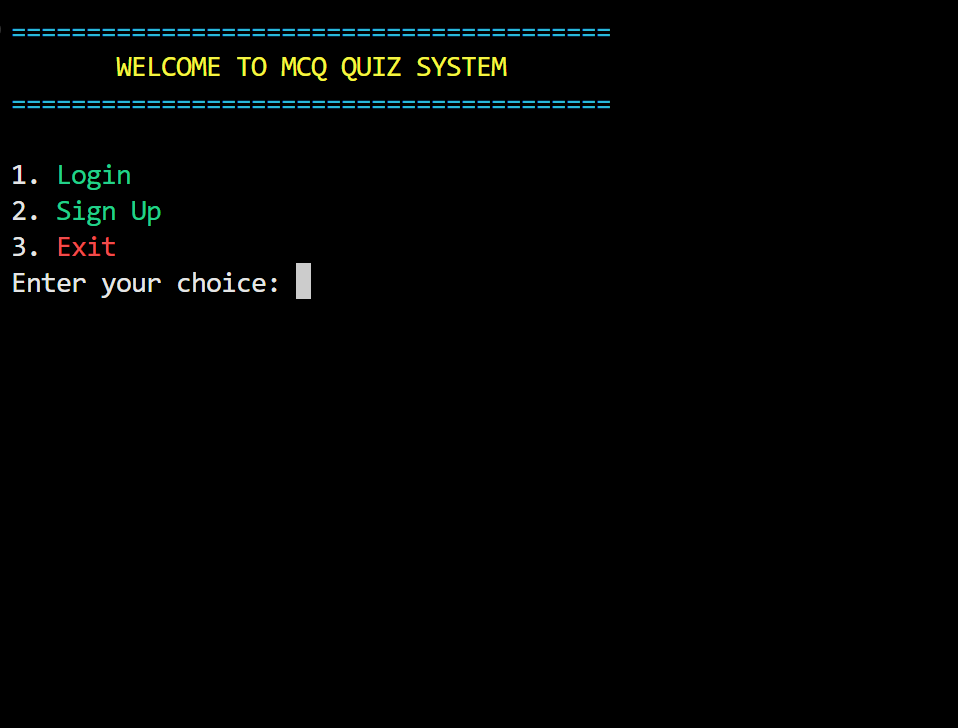
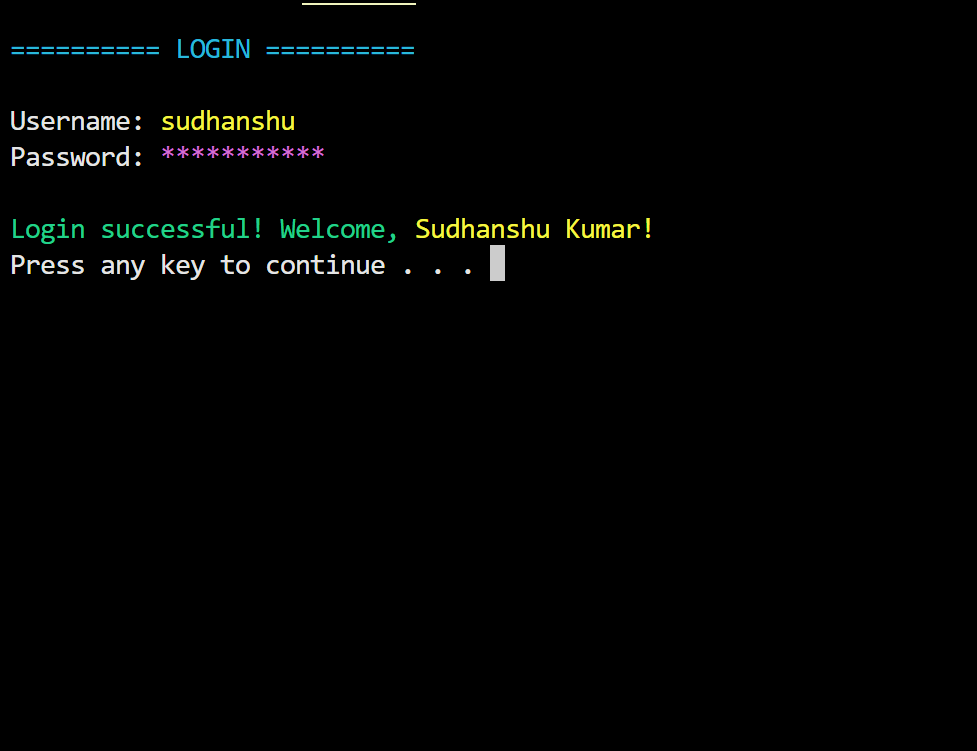
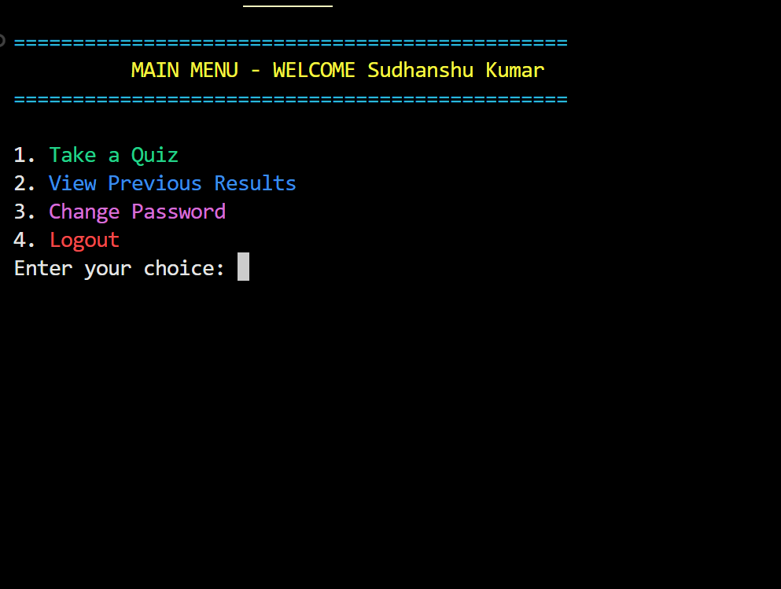
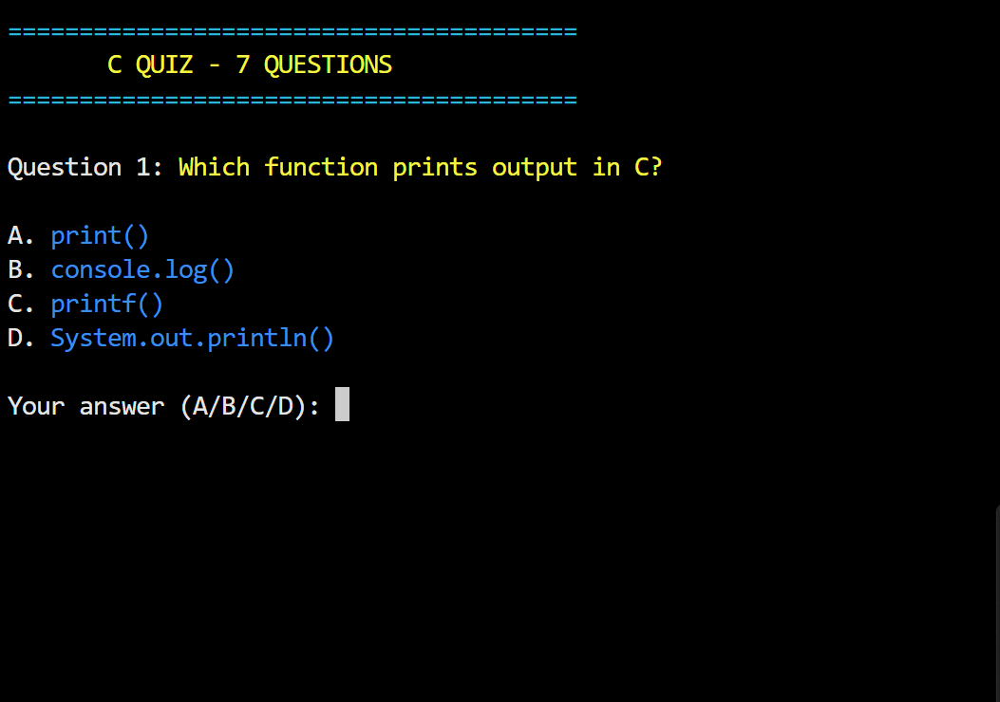
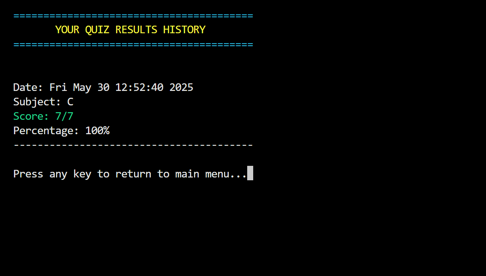

# 🎯 MCQ Quiz System

- MCQ Quiz System is a colorful, interactive multiple-choice quiz game built in **C++**.

- The objective is to test and improve your programming knowledge across various subjects like  C, C++, Python, Java, HTML, CSS, and more.

- It includes secure login, random questions, performance tracking, and a vibrant console-based interface to make learning fun and effective.

---

## 📸 Screenshots

  
  

  
  

  
  

---

## ✨ Features

- 🔐 **Secure Authentication:** Login/signup system with password validation  
- 📚 **Multi-Subject Quizzes:** 8 different programming subjects available  
- 🌈 **Colorful Interface:** Windows console with vibrant colored text  
- 📊 **Performance Tracking:** Save and view quiz history with timestamps  
- 🔒 **Password Security:** Masked input with strong validation rules  
- 🎲 **Random Questions:** Shuffled questions for each quiz session  
- 💾 **File-Based Storage:** Persistent data storage using text files  
- 🎯 **Scoring System:** Percentage-based performance evaluation  

---

## 💻 System Requirements

- 🖥️ **OS:** Windows (uses Windows-specific libraries)  
- ⚙️ **Compiler:** C++ compiler (Visual Studio, MinGW, Dev-C++, etc.)  
- 📟 **Environment:** Console/Terminal application  
- 💾 **Storage:** Minimal disk space for user data and questions  

---

## 🚀 Installation & Setup

### Step 1: Download

    git clone https://github.com/yourusername/mcq-quiz-system.git
    cd mcq-quiz-system

### step 2: Compile

    g++ -o quiz_system main.cpp

### Step 3: Run

    ./quiz_system.exe

## 📁 Project Structure

        MCQ-Quiz-System/
    ├── 📄 main.cpp                    
    ├── 📂 images/                     
    │   ├── 🖼️ banner.png
    │   ├── 🖼️ welcome-screen.png
    │   ├── 🖼️ login-screen.png
    │   ├── 🖼️ quiz-screen.png
    │   └── 🖼️ results-screen.png
    ├── 📄 users.txt                   
    ├── 📄 questions.txt               
    ├── 📄 results_[username].txt      
    └── 📄 README.md                   

## 🎮 How to Use

### 👤 New User Registration

- Launch the application  
- Select **"Sign Up"** from welcome screen  
- Enter your full name  
- Create a username (5–15 alphanumeric characters)  
- Set a secure password (see rules below)  

### 🔑 Existing User Login

- Select **"Login"** from welcome screen  
- Enter your username and password  
- Access the main menu  

### 📝 Taking a Quiz

- Choose **"Take a Quiz"** from main menu  
- Select subject from available options  
- Answer 10 randomly selected questions  
- View your results and score  

### 📊 View Results

- Select **"View Previous Results"** to see quiz history  
- All results are saved with timestamps  
- Track your performance over time  

---

## 🎨 Available Quiz Subjects

| Subject     | Emoji | Status         |
|-------------|-------|----------------|
| C           | 💻    | ✅ Available    |
| C++         | ⚡    | ✅ Available    |
| HTML        | 🌐    | ✅ Available    |
| CSS         | 🎨    | ✅ Available    |
| JavaScript  | 📜    | ✅ Available    |
| PHP         | 🐘    | ✅ Available    |
| Python      | 🐍    | ✅ Available    |
| Java        | ☕    | ✅ Available    |

---

## 🔐 Security Features

### 🔒 Password Requirements

- ✅ Length: 8–20 characters  
- ✅ Must include at least one digit (0–9)  
- ✅ Must include at least one special character (`!@#$%^&*`)  
- ✅ Real-time password strength checking  

### 👤 Username Rules

- ✅ Length: 5–15 characters  
- ✅ Alphanumeric only (letters and numbers)  
- ✅ Must be unique  

---

## 🛠️ Technical Details

- **Language:** C++  
- **Platform:** Windows  
- **Dependencies:** `windows.h`, `conio.h`  
- **Storage:** File-based system  
- **Architecture:** Modular function-based design  
- **UI:** Console-based with color support  

### 🔧 Key Functions

- User authentication and validation  
- Question loading and shuffling  
- Score calculation and storage  
- File I/O operations  
- Console color management  

---

### 💬 Get in Touch For:

- 🐛 Bug Reports  
- 💡 Feature Requests  
- 🤝 Collaboration  
- ❓ General Support  

---

# Feedback
If you have any feedback, please reach out to us at sudhanshu95084145@gmail.com

Thanks for visiting! 🎉
