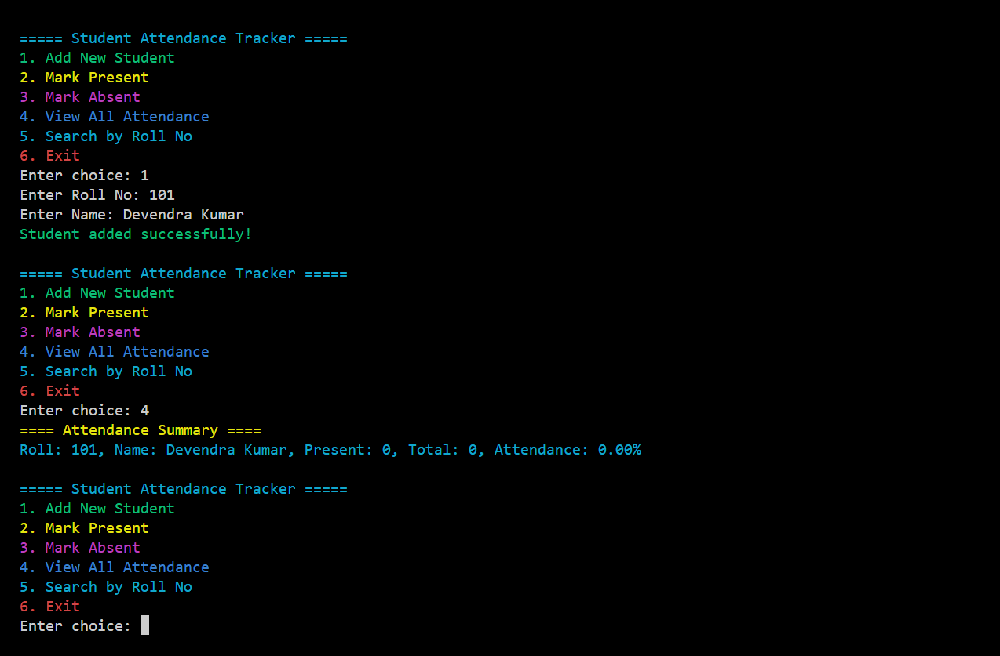

# 🎓 Student Attendance Tracker System

A simple console-based **C++** program to manage student attendance records.  
This system allows adding students, marking their attendance as present or absent, viewing all attendance records, and searching students by roll number.

---

## 📸 Screenshot

## ✨ Features

- ➕ Add new students with roll number and name  
- ✅ Mark attendance as **Present**  
- ❌ Mark attendance as **Absent**  
- 📊 View attendance summary for all students  
- 🔍 Search students by roll number  
- 💾 Persistent data storage using a binary file (`students.dat`)  
- ✅ Input validation with error handling  
- 🌈 Color-coded console output for better readability  

---

## 🛠️ Requirements

- A C++ compiler supporting C++11 or above (e.g., `g++` on Linux/Windows/WSL, MinGW, or Visual Studio)  
- Terminal or command prompt with ANSI escape code support for colored output (most modern terminals support this)  

---

## 🚀 How to Compile and Run

1. **Compile the program**:

   g++ main.cpp -o attendance_tracker

2. **Run the program**:

    ./attendance_tracker   # On Linux/macOS/WSL

    attendance_tracker.exe # On Windows (Command Prompt or PowerShell)

## 🧑‍💻 Usage

- ➕ Add New Student: Enter a unique roll number and student name.

- ✅ Mark Present / Absent: Mark attendance for a student by entering their roll number.

- 📊 View All Attendance: Displays attendance percentage and details of all students.

- 🔍 Search by Roll No: Search and view details of a student by roll number.

- ❎ Exit: Quit the program.

All data is saved in the students.dat file, enabling persistent records between runs.

## 📚 Code Highlights

- 🗃️ Uses binary file I/O for efficient reading/writing of student records.

- 🏷️ Encapsulates student data and behavior in a Student class.

- 🛡️ Input validation to ensure correct roll numbers and names.

- 🌈 Colorful terminal output using ANSI escape codes for better UX.

- 🔒 File operations handle appending and updating records safely.

## ⚠️ Notes

- The program requires a terminal that supports ANSI colors to display colored output correctly.

- If using Windows Command Prompt, you might need to enable ANSI escape sequences or use Windows Terminal / PowerShell.

- Roll numbers must be unique integers greater than 0.

## 👤 Author

Sudhanshu Kumar – BCA Student & C++ Learner

## 🤝 Contributions
Feel free to fork the repo and contribute new features, bug fixes, or enhancements via pull requests. Collaboration is warmly welcome!

Thank you for checking out the Student Attendance Tracker! 🎉