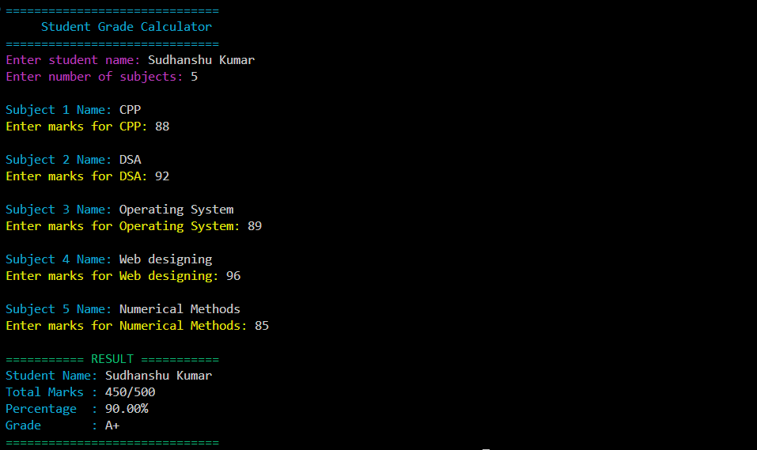

# 🎓 Student Grade Calculator

A console-based C++ application that allows users to input subject names and marks, then automatically calculates the overall percentage and corresponding grade.

Designed with **color-coded outputs**, **robust input validation**, and **user-friendly UI** for a better terminal experience.

---

## 🚀 Demo

#### 📸 Screenshots

  

## ✨ Features

- 📌 **Add Subject Details** – Enter subject names and marks (marks must be between 0–100).
- 🔍 **Validation** – Ensures:
  - Subject names are alphabetic (letters and spaces only)
  - Marks are numeric (0–100 range)
- 📊 **Automatic Grade Calculation** – Based on total percentage.
- 🎨 **Colored Terminal Output** – Uses ANSI escape codes for better visual feedback.

---

## 🧮 Grade Criteria

| Percentage       | Grade |
|------------------|-------|
| 90 and above     | A+    |
| 80 - 89          | A     |
| 70 - 79          | B+    |
| 60 - 69          | B     |
| 50 - 59          | C     |
| 40 - 49          | D     |
| Below 40         | F     |

---

## 🛠️ Tech Stack

| Technology   | Purpose                               |
|--------------|----------------------------------------|
| C++          | Core application logic                 |
| Regex        | Subject name validation                |
| ANSI Colors  | Terminal UI enhancement                |
| `<iomanip>`  | Formatted output (precision, spacing)  |

---

## 📜 Application Rules

- Subject names must contain **only letters and spaces**.
- Marks must be **numeric values between 0 and 100**.
- Number of subjects must be a **positive integer**.
- Grade is assigned automatically based on **average percentage**.

---

## 📧 Feedback

If you have any suggestions, feedback, or improvements:

- 📬 **Email**: sudhanshu95084145@gmail.com  

---

🌟 *If you found this project helpful, consider starring the repository on GitHub!* 🌟
