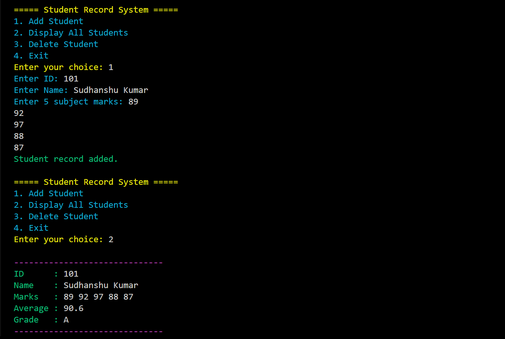

# 🎓 Student Record Management System

A **C++ CLI-based project** for managing student academic records using file handling, OOP, and terminal color output. This system allows you to:

- Add new student records
- View all saved records
- Delete records by student ID
- Store and retrieve data from a binary file (`students.dat`)

---

## 📸 Screenshot

## 🚀 Features

- Object-Oriented Design (Classes & Encapsulation)
- Binary File Handling (`fstream`)
- Color-coded terminal UI using ANSI escape codes
- Easy-to-use menu-driven interface

---

## 🧰 Technologies Used

- **C++17 or above**
- File I/O (Binary mode)
- ANSI Escape Codes for Text Color (Linux/Unix/Windows Terminal with support)

---

## 🗃️ File Structure

main.cpp    # Main source file  
students.dat                 # Binary data file (auto-generated after adding records)  
README.md                    # Project documentation  

## 🧑‍💻 How to Compile & Run

-  g++ main.cpp -o student_system ./student_system

## 📝 Future Enhancements
- Search student by ID or name

- Modify existing student records

- Export to CSV format

- Password-protected Admin Mode

- GUI version using Qt or SFML

## 📚 Learning Objectives

- Practice C++ Object-Oriented Programming

- Understand binary file serialization

- Implement menu-driven CLI applications

- Learn cross-platform terminal text formatting

## 📌 License
This project is open-source and free to use for educational purposes.

## ✍️ Author
Sudhanshu Kumar
BCA Student & C++ Learner

🙌 Contributions
Feel free to fork this repo and contribute new features, bug fixes, or enhancements via pull requests. Collaboration is welcome!

