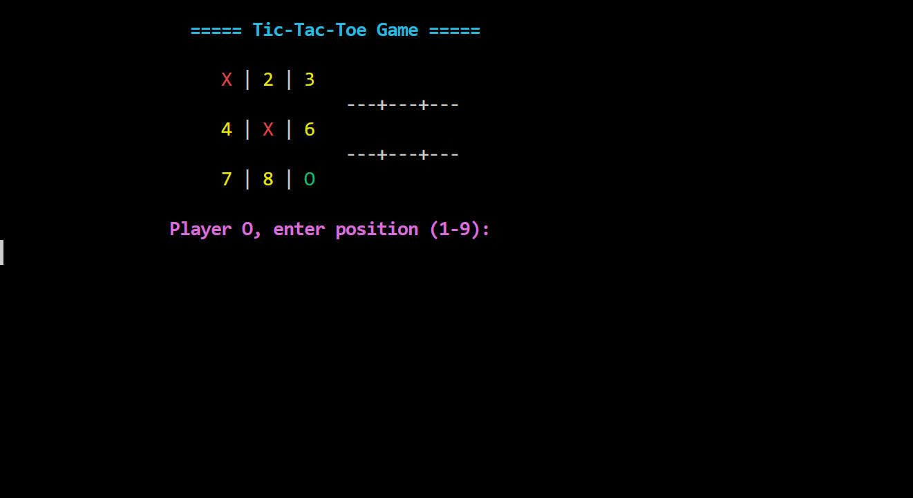

# 🎮 Tic-Tac-Toe Game (C++ Console Application)

- The **Tic-Tac-Toe Game** is a terminal-based 2-player C++ application that allows users to play the classic game in a visually enhanced environment using ANSI color codes.

- It supports turn-based gameplay, detects wins/draws, and handles invalid inputs smartly.

- Designed for smooth interaction, educational purpose, and console clarity with centered and colored output.

---

## 🚀 Demo

#### 📸 Screenshot

  

---

## ✨ Features

- ❌🟢 Turn-Based Gameplay – Player X and O alternate moves.

- 🏆 Win & Draw Detection – Automatically identifies winners or draws.

- 🚫 Smart Input Validation – Prevents invalid or already-taken positions.

- 🔢 Board Numbering – Unoccupied cells show numbers for guidance.

- 🎨 Colored Interface – X in Red, O in Green, Empty in Yellow for better visuals.

- 📐 Centered Output – Game board is aligned to the center for better UI.

- ⚙️ Cross-Platform – Compatible with Linux, Windows, and macOS terminals.

---

## 🕹️ How to Use

- **Start Game** – Run the executable and follow the prompts.

- **Make a Move** – Enter a number (1-9) corresponding to a cell.

- **Invalid Input** – The game prompts again if input is out of range or already used.

- **Win Condition** – First to align 3 same symbols (row/column/diagonal) wins.

- **Draw Condition** – If all 9 cells are used with no winner, it's a draw.

---

## 📜 Game Rules

- Only positions 1 to 9 are accepted.

- No cell can be overwritten once marked.

- Player X always starts first.

- Game ends automatically on win or draw.

- Exit prompt appears after the result.

---

## 🛠️ Tech Stack

| Technology   | Purpose                                |
|--------------|----------------------------------------|
| C++          | Core game logic                        |
| Vectors      | Board data structure                   |
| iostream     | Input and Output                       |
| ANSI Colors  | Color-coded terminal UI                |
| stdlib       | Clear screen function (system call)    |

---

## 🔧 Compile and Run

## Compile
g++ -o tic_tac_toe main.cpp

### Run
./tic_tac_toe   # On Linux/macOS

tic_tac_toe.exe # On Windows

## 📫 Feedback

If you have any suggestions, bug reports, or improvements:

**📬 Email:** sudhanshu95084145@gmail.com  

